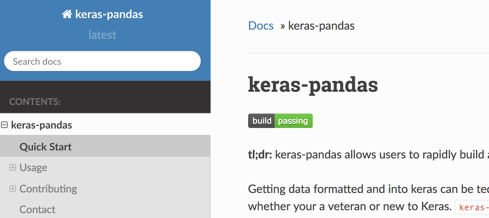

# Cheat sheet: Publishing a Python Package

## Or: Notes to myself to make publishing a package easier next time

**tl;dr:** TODO

*The final product*

## Why?

Publishing a Python package is a surprisingly rough process, which requires tying together many different solutions 
with brittle interchanges. While the content of Python packages can vary wildly, I'd like to focus on the workflow
for getting packages out into the world. 

I knew from colleagues and from a few failed attempts that writing and publishing a package would be a daunting 
experience. However, I savor a challenge, and boy what a challenge it was. 

Here are my 'notes to self' for making the process smoother next time, and lowering the barrier to entry for others

## Default path

### Implementation

A strong workflow while building out the package might look like:

 - **Choose Documentation formats:**
   - **Docstring format:** Sphinx's [rST](http://www.sphinx-doc.org/en/master/usage/restructuredtext/basics.html) 
   (as suggested in [PEP 287](https://www.python.org/dev/peps/pep-0287/)) provides a strong format for writing 
   docstrings, and is well supported for auto-generating package documentation
   - **README, project files:** [GitHub-flavored markdown](https://github.github.com/gfm/) is the modern standard for 
   project documentation files, such as `README` files  
 - **Design:** There are many opinions on how to design packages. I recommend writing out the interfaces for the 
 methods and classes you'll need, but these decisions are outisde the scope of this post.
 - **Create `setup.py` file:** Less is more. There are many parameters here, but following the 
 [python.org example](https://packaging.python.org/tutorials/packaging-projects/#creating-setup-py) will get all of 
 the basics.
 - **Unit tests:** This will be controversial, but by popular opinion unit tests are necessary for a good package.  
 Python's built in [unittest](https://docs.python.org/3/library/unittest.html) framework avoids the complexity and 
 overhead of other packages, and should be the default until you actively need a missing feature 

## Releasing

*Every programmer's dream: A passing CI build*

Once you've got a working code base and (you think) you're ready to share it with the world, there a few steps to get 
your work out there:

 - **Packaging:** First, we'll have to create distribution packages, by following the 
 [Python.org instructions](https://packaging.python.org/tutorials/packaging-projects/#generating-distribution-archives). 
 These packages are what are actually uploaded to the PyPI servers, and downloaded by other users.  
 - **PyPI Upload:** Second, we'll upload our packages to PyPI. The [Python.org](https://packaging.python.org/tutorials/packaging-projects/#uploading-the-distribution-archives)
 instructions cover most of the steps to upload to the test environment. To upload to the actual environment, 
 run `twine upload -u PYPI_USERNAME  dist/*`. Congrats! Your package is now public!
 - **Continuous integration:** Once things are up and running, it's helpful to set up [Travis CI](https://travis-ci.org/). 
 While many competitors exist, Travis CI is common, free, and easy to setup & use. For those who are unfamiliar, 
 [continuous integration](https://www.atlassian.com/continuous-delivery/continuous-integration-intro) can automatically 
 runs unittests for commits and PRs, helping to prevent releasing bugs into the wild.
 
Congrats! You now written, documented, and released a package! Lather, rinse & repeat. 

## Backstory

To give a bit of back story, I've worked in deep learning for a while and wanted to build a package that allows users 
to rapidly build and iterate on deep learning models. Through borrowing concepts from kaggle grandmasters, and 
iterated on many of the concepts while leading teams within Capital One's Machine Learning center of excellence. 